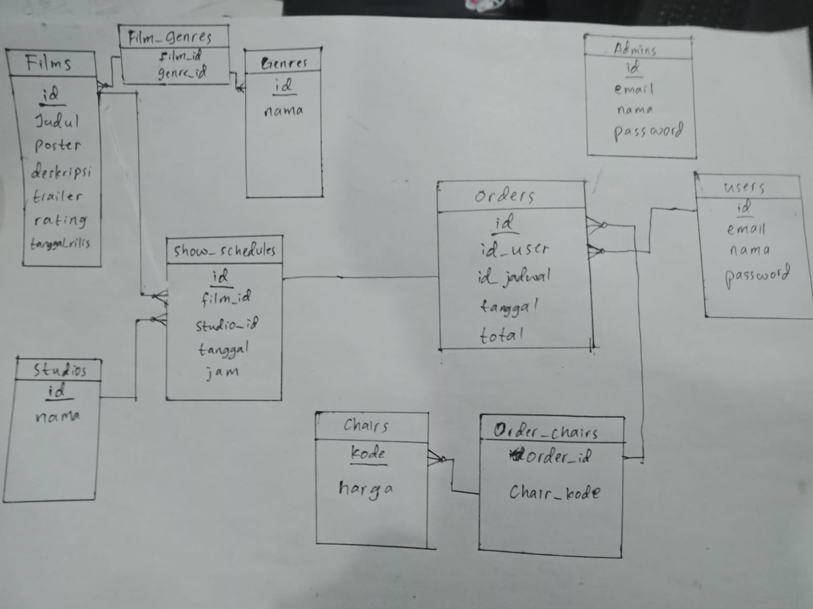

# AP Cinema

AP Cinema : Nikmati Momenmu Dalam Cinema

> AP Cinema adalah aplikasi inovatif yang dirancang untuk memberikan pengalaman pemesanan tiket bioskop yang lebih mudah dan nyaman bagi pengguna serta efisien bagi admin. Aplikasi ini memungkinkan pengguna untuk dengan mudah memilih film yang ingin mereka tonton, memilih jadwal yang sesuai, dan melakukan pembayaran dalam hitungan menit. Di sisi admin, aplikasi ini membantu dalam manajemen jadwal film, pengelolaan kursi, dan pemantauan transaksi secara real-time.

> Project ini masih dalam pengembangan.

## Fitur

Fitur untuk **Pengguna**:
- Pemilihan Film: Pengguna dapat menjelajahi berbagai film yang sedang tayang, termasuk informasi tentang genre, sinopsis, pemain, dan trailer.
- Pemilihan Jadwal: Pengguna dapat melihat jadwal tayangan yang tersedia untuk film tertentu, termasuk waktu mulai dan lokasi bioskop.
- Pemilihan Kursi: Setelah memilih film dan jadwal, pengguna dapat memilih kursi yang mereka inginkan di dalam bioskop melalui tampilan interaktif peta kursi.
- Pembayaran Mudah: Pengguna dapat membayar tiket secara online melalui berbagai metode pembayaran yang aman dan nyaman.
- Tiket Elektronik: Setelah pembayaran selesai, pengguna akan menerima tiket elektronik yang dapat mereka tampilkan saat memasuki bioskop.

Fitur untuk **Admin**:
- Kelola film
- Kelola genre
- Kelola user
- Kelola admin
- Kelola jadwal
- MKelola pemesanan

## Diagram ER

## Tech stack

- Frontend: React, MUI, Tailwindcss
- Backend: Golang Gin
- Basis data: PostgreSQL